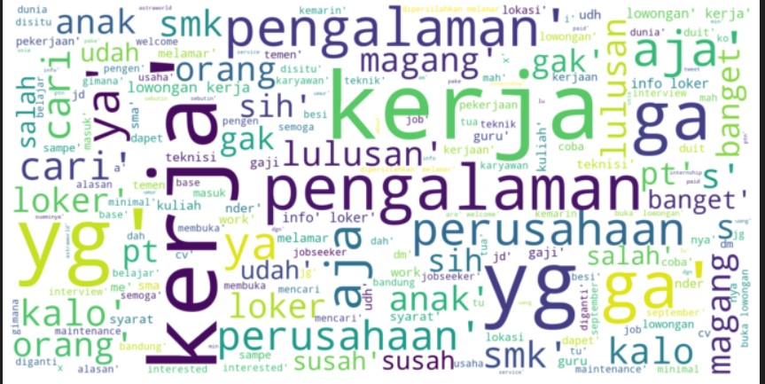
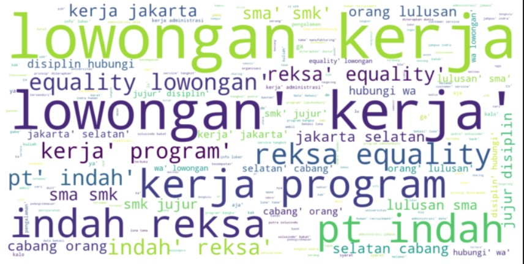
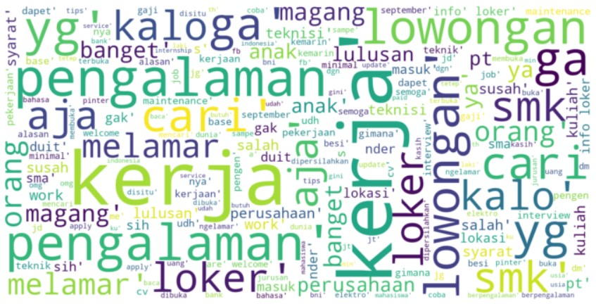
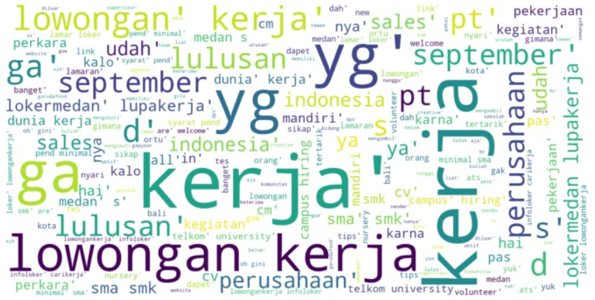

# Sentiment-Analysis

**Business Understanding** :
The topic chosen is fresh graduate. The topic was chosen because currently there are many students who have just graduated/graduated in these months. From this topic, a classification can be made related to articles/tweets about fresh graduates, to find out how many categories can be created and details related to those categories.

**Data** : 208 Tweets

**Text Preprocessing**
- Case Folding : remove punctuation and non-letter characters
- Stopword : remove unnecessary conjunctions in sentence analysis
- Slang Word : handle slang words contained in sentences

**Text Data Analysis**
- most common word : The most frequently occurring words
    - kerja : 127
    - lowongan : 77
    - pt : 39
- Distribusi bi-gram : Frequency distribution of each bigram (2 words) in a sentence
    - (lowongan, kerja) : 66
    - (sma, smk) : 27
    - (kerja, program) : 25

**Model** : KNN with 4 clusters
- Wordcloud class 1

- Wordcloud class 2

- Wordcloud class 3

- Wordcloud class 4

